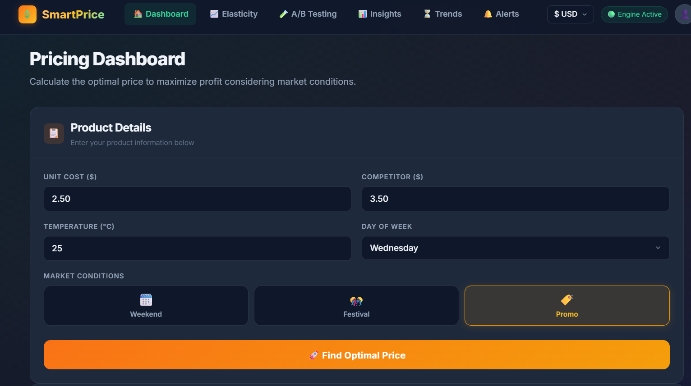
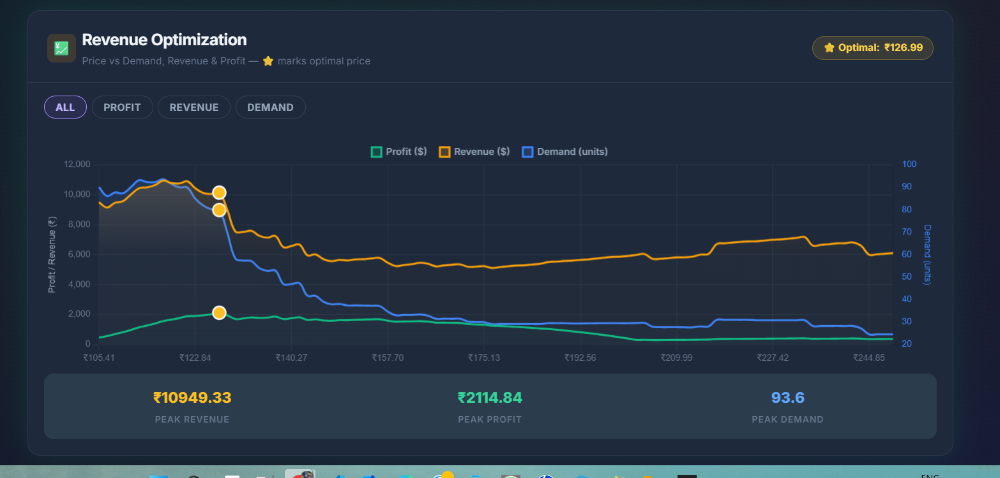
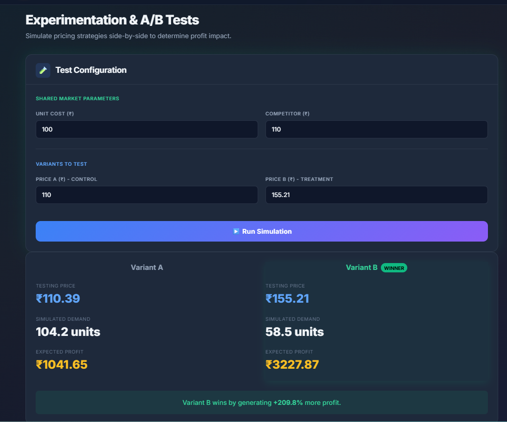
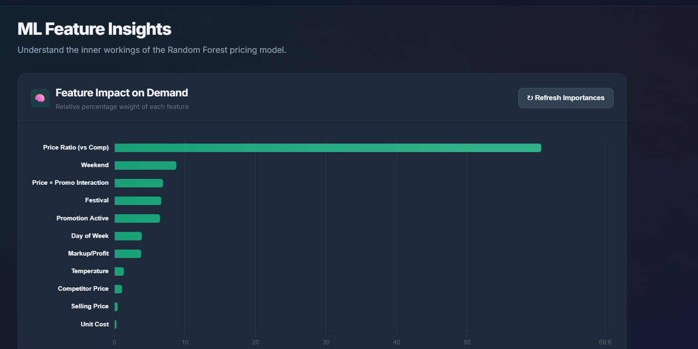

<div align="center">


<br/>

[](https://python.org)
[](https://flask.palletsprojects.com)
[](https://scikit-learn.org)
[](https://chartjs.org)
[](LICENSE)
[]()

<br/>

> **SmartPrice** is a production-ready, AI-powered dynamic pricing SaaS application built for small retailers. It uses a trained **Random Forest** model to analyze market conditions and recommend the optimal price that **maximizes profit** in real time.

<br/>

</div>


## 🌐 Live Deployment

**🎉 Project is LIVE on Render!**

### Access the Application:

```
https://smartprice-ai-imrn.onrender.com
```


## ✨ Features at a Glance

| Feature | Description |
|---|---|
| 🤖 **AI Pricing Engine** | Random Forest model trained on real market signals |
| 💹 **Revenue Optimization** | Interactive Price vs. Profit vs. Demand curves |
| 🧪 **A/B Price Testing** | Simulate two prices and compare predicted outcomes |
| 📊 **Feature Insights** | Visual feature importance from the ML model |
| 💱 **Currency Toggle** | Switch between ₹ INR and $ USD dynamically |
| ⚡ **Vectorized Inference** | 100x faster bulk predictions via Numpy vectorization |
| 🗜️ **GZip Compression** | Flask-Compress reduces API payload sizes dramatically |
| 🔔 **Smart Alerts** | Price alert thresholds and monitoring |
| 📈 **Trend Analysis** | Historical pricing trends over time |

---

## 🧠 How the AI Works

```
User Inputs (Cost, Competitor Price, Season, Promo...)
        │
        ▼
┌──────────────────────────────────────────────┐
│         Feature Engineering Layer            │
│  price_ratio, markup, price_x_promo, ...     │
└──────────────────────────────────────────────┘
        │
        ▼
┌──────────────────────────────────────────────┐
│       Random Forest Regressor (Trained)      │
│  Predicts Demand across 500 price candidates │
│  via fully vectorized NumPy batch inference  │
└──────────────────────────────────────────────┘
        │
        ▼
  Profit = (Price − Cost) × Predicted Demand
        │
        ▼
    argmax(Profit) → 🎯 Optimal Price
```

---

## 📸 Screenshots

> *Screenshots of the live dashboard, revenue optimization chart, and A/B testing panel.*

<div align="center">

| Dashboard | Revenue Optimization |
|:---------:|:--------------------:|
|  |  |

| A/B Testing | Feature Insights |
|:-----------:|:----------------:|
|  |  |

</div>

---

## 🗂️ Project Structure

```
📦 data_driven_dynamic_pricing/
├── 📁 src/
│   ├── pricing_engine.py      # Core ML inference & optimization engine
│   └── model_training.py      # Model training & evaluation pipeline
│
├── 📁 templates/
│   ├── base.html              # Base Jinja2 layout (navbar, currency toggle)
│   ├── index.html             # 🏠 Main dashboard + Revenue Chart
│   ├── elasticity.html        # 📈 Price elasticity analysis
│   ├── ab_testing.html        # 🧪 A/B price experiment simulator
│   ├── insights.html          # 📊 Feature importance visualization
│   ├── trends.html            # ⏳ Historical price trends
│   └── alerts.html            # 🔔 Smart price alert configuration
│
├── 📁 models/
│   ├── pricing_model.pkl      # Trained Random Forest model
│   ├── scaler.pkl             # StandardScaler for feature normalization
│   └── model_metadata.json    # Model metrics, feature names
│
├── app.py                     # Flask application & API routes
├── gunicorn.conf.py           # Production WSGI server config
├── render.yaml                # Render deployment blueprint
├── requirements.txt           # Dev dependencies
├── requirements-prod.txt      # Production dependencies (lean)
├── APIs.txt                   # API endpoint reference
└── README.md
```

---

## 🚀 Quick Start

### Prerequisites

- Python 3.10+
- pip
- Git

### 1. Clone the Repository

```bash
git clone https://github.com/YOUR_USERNAME/smartprice-dynamic-pricing.git
cd smartprice-dynamic-pricing
```

### 2. Create & Activate Virtual Environment

```bash
# Windows
python -m venv venv
venv\Scripts\activate

# macOS / Linux
python -m venv venv
source venv/bin/activate
```

### 3. Install Dependencies

```bash
pip install -r requirements.txt
```

### 4. Train the Model

```bash
python src/model_training.py
```

> This will generate `models/pricing_model.pkl`, `models/scaler.pkl`, and `models/model_metadata.json`.

### 5. Run the Application

```bash
python app.py
```

Open your browser and navigate to **[http://localhost:5000](http://localhost:5000)** 🎉

---

## 🔌 API Reference

### `POST /api/predict`
**Recommend the optimal price for a product.**

```json
// Request Body
{
  "cost": 2.50,
  "competitor_price": 3.50,
  "temperature": 25.0,
  "is_weekend": 0,
  "is_festival": 0,
  "promo": 1,
  "day_of_week": "Wednesday"
}
```

```json
// Response
{
  "success": true,
  "optimal_price": 3.95,
  "predicted_demand": 42.3,
  "expected_profit": 60.43,
  "margin_pct": 58.0,
  "price_vs_competitor": 12.86,
  "model_name": "RandomForest",
  "demand_curve": [...]
}
```

---

### `POST /api/ab-test`
**Simulate an A/B price experiment.**

```json
// Request Body
{
  "price_a": 3.50,
  "price_b": 4.25,
  "cost": 2.50,
  ...
}
```

---

### `GET /api/insights`
Returns feature importance scores from the trained model.

---

### `GET /api/health`
Health check — returns model loaded status.

---

## 🛠️ Technology Stack

| Layer | Technology |
|---|---|
| **Backend** | Python 3.12, Flask 3.x |
| **ML Engine** | Scikit-learn (Random Forest), NumPy, Pandas |
| **Frontend** | Vanilla JS, Chart.js 4.4.0 |
| **Styling** | Custom CSS (Dark Mode, Glassmorphism) |
| **Compression** | Flask-Compress (GZip/Brotli) |
| **Production** | Gunicorn, Render |
| **Storage** | Joblib model serialization |

---

## 🌍 Deployment

### Deploy on Render (Recommended)

This project includes a `render.yaml` blueprint for one-click deployment:

1. Push this repository to GitHub
2. Connect to [Render](https://render.com) and select **"New Blueprint"**
3. Select your repository → Render auto-detects `render.yaml`
4. Click **Deploy** ✅

### Environment Variables

| Variable | Description | Default |
|---|---|---|
| `FLASK_ENV` | `production` or `development` | `development` |
| `PORT` | Application port | `5000` |

---

## 📊 Model Performance

| Metric | Score |
|---|---|
| **Algorithm** | Random Forest Regressor |
| **R² Score** | `0.9564` |
| **MAE** | Evaluated on held-out test set |
| **Training Features** | 12 engineered features |
| **Price Candidates** | 500 per inference (vectorized) |
| **Inference Type** | Fully vectorized (batch NumPy) |
| **Cache** | LRU Cache (128 unique scenarios) |

---

## 💱 Currency Support

SmartPrice supports seamless **INR ↔ USD** switching:

- 🇮🇳 **Default: ₹ INR** (optimized for small Indian retailers)
- 🇺🇸 **USD**: Switch instantly from the navbar dropdown
- All form inputs, chart axes, tooltips, and results auto-convert
- Currency preference persisted via `localStorage`

---

## 🔮 Future Improvements

- [ ] 🗄️ **Database Integration** — Store historical predictions in PostgreSQL
- [ ] 🔐 **User Authentication** — Multi-tenant SaaS with login/accounts
- [ ] 📧 **Email Alerts** — Notify users when price thresholds are crossed
- [ ] 📱 **Mobile Responsive UI** — Full PWA support
- [ ] 🔄 **Real-time Competitor Scraping** — Auto-populate competitor prices
- [ ] 🤖 **XGBoost / LightGBM upgrade** — Ensemble model improvements
- [ ] 🌐 **REST API Keys** — Public API for third-party integrations
- [ ] 📦 **Docker Support** — Containerized deployment

---

## 🤝 Contributing

Contributions are welcome! Here's how to get started:

```bash
# 1. Fork the repository
# 2. Create a new feature branch
git checkout -b feature/AmazingFeature

# 3. Commit your changes
git commit -m 'Add AmazingFeature'

# 4. Push to the branch
git push origin feature/AmazingFeature

# 5. Open a Pull Request
```

Please make sure to follow the existing code style and include unit tests for new ML features.

---

## 📄 License

This project is licensed under the **MIT License** — see the [LICENSE](LICENSE) file for details.

---

## 👩‍💻 Author

<div align="center">

**Riya Bisht**

[](https://github.com/YOUR_USERNAME)
[](https://linkedin.com/in/YOUR_PROFILE)

*Built with 💚 and a whole lot of ☕*

---

⭐ **Star this repository if you found it useful!** ⭐

</div>
